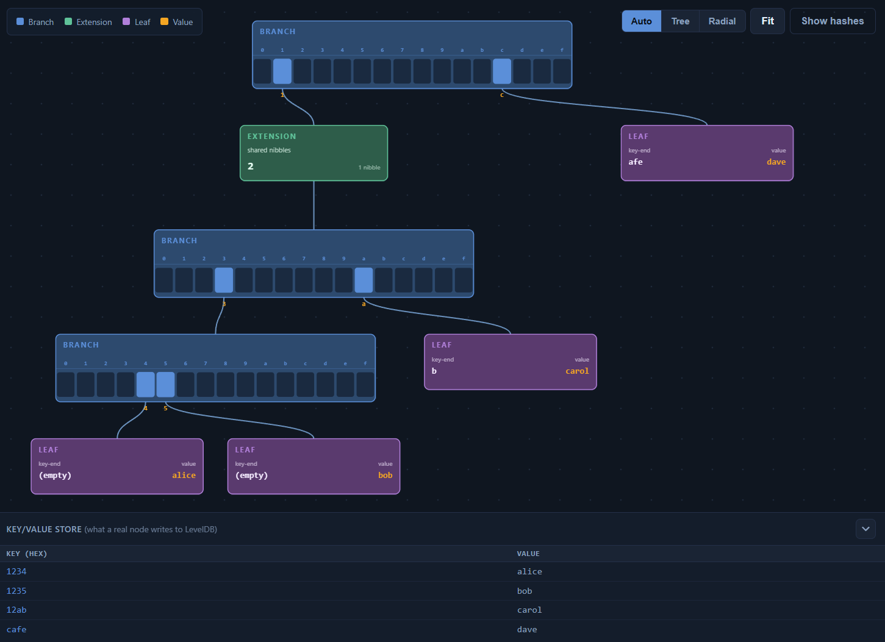
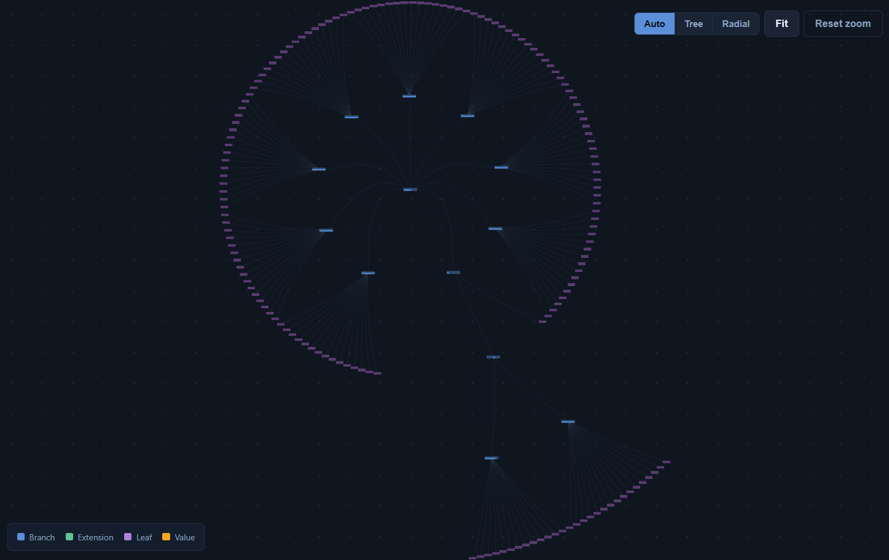

# MPT Visualizer

[](https://github.com/medaymann/mpt-visualizer/actions/workflows/test.yml)

An interactive Merkle Patricia Trie explorer with two modes:

- **Custom** — build a trie from your own hex-keyed entries and watch
  how branches, extensions, and leaves form.
- **Ethereum block** — load any block from Ethereum mainnet, rebuild
  its transactions trie, and verify the computed root against
  `block.transactionsRoot` from the block header.

Tries are built in Rust, hashed with keccak, and (for blocks) checked
against the on-chain root.

---

## Screenshots

**Custom mode** — small trie built from hand-entered hex keys.



**Ethereum block mode** — transactions trie for block 7,777,777, verified against the on-chain root.



---

## Running

You need both the **Rust backend** and a **static server** for the
frontend.

```bash
# terminal 1 — backend on http://localhost:8081
npm run backend:build      # one-time
npm run backend:run

# terminal 2 — frontend on http://localhost:8080
npm run serve
```

Open <http://localhost:8080>. Both modes call the backend, so it must
be running.

---

## Testing

```bash
npm test                  # frontend unit tests (rlp + block-id helpers)
npm run backend:test      # backend unit tests (rlp, mpt, rpc)
npm run backend:verify    # integration tests fetching real blocks
```

`backend:verify` requires internet access and runs the trie against
several real blocks spanning every transaction-type era: genesis,
legacy, EIP-2930, EIP-1559, post-merge, and latest. Each test asserts
that the computed root matches the on-chain `transactionsRoot`.

---

## How verification works

Both modes go through the Rust backend so the displayed trie is
always backed by canonical RLP + keccak.

**Ethereum mode** (`GET /api/block/:id`)

1. Re-encode each transaction as canonical RLP. Every tx type is
   supported: legacy, EIP-2930 (0x01), EIP-1559 (0x02), EIP-4844 blob
   (0x03), EIP-7702 set-code (0x04).
2. Insert `(RLP(tx_index), tx_envelope_bytes)` into a Merkle Patricia
   Trie.
3. Compute the trie's keccak root and compare to
   `block.transactionsRoot`.
4. If the roots don't match, the API returns HTTP 422 and the
   frontend refuses to render.

---

## Project layout

```
backend/                Rust service (Axum)
  src/
    main.rs             HTTP routes, request handling, LRU cache
    rpc.rs              JSON-RPC client with hedged parallel calls
    rlp.rs              RLP encoder
    mpt.rs              Trie insert, hex-prefix encoding, keccak root
    tx.rs               Canonical RLP for every transaction type
  tests/
    verify_real_blocks.rs   Integration tests against live blocks

src/
  styles.css            Page styles
  visualization/        d3/SVG rendering
    Renderer.js         Pan/zoom, drag, layout selection, level-of-detail,
                        path highlight, layout-switch animation
    LayoutEngine.js     Top-down tidy tree
    RadialLayout.js     Concentric rings (used when the trie is wide)
    BranchVisual.js, ExtensionVisual.js, LeafVisual.js, VisualNode.js
    ConnectionManager.js
    config.js
  ui/                   Orchestration
    App.js              Boots everything, wires the page
    MPTVisualizer.js    Tracks state, delegates trie construction to backend
    EthereumService.js  HTTP client for the Rust backend
    stats.js            countNodes() for the sidebar stats panel
    examples.js         Preset key/value sets shown as chips
    recentBlocks.js     localStorage-backed history of recently loaded blocks

tests/                  Frontend test suite (node --test)
index.html              Page shell
```

---

## Limitations

- In Ethereum mode, only the **transactions trie** is visualized, not the state or
  receipts trie. The transactions trie is rebuilt per block from
  `txs[0..n]` and is small and self-contained. The state trie spans
  hundreds of millions of accounts and would need an archive node.
